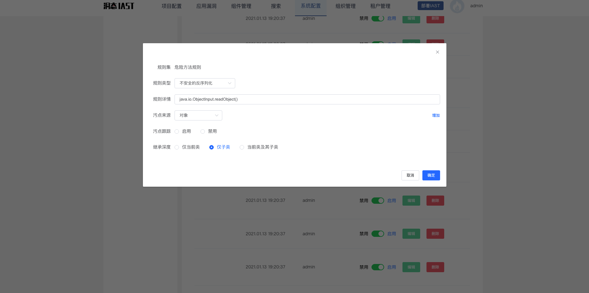

内置的hook点可满足大部分情况，但是为了挖掘内置策略外的漏洞，一定会涉及到自定义hook点（source点、传播节点、sink点）；下面介绍洞态IAST的hook点配置相关内容

### 自定义Hook规则

> HOOK点语法

自定义规则：https://iast.huoxian.cn/setting/hookRule

规则分类：
- 污点源方法规则（source方法）：检测从http请求中读取数据，规则内置在agent中，默认不需要配置
- 传播方法规则：用于处理部分污点关联不上的情况，如果方法的内部逻辑过于复杂导致无法自动识别出污点变化，可通过配置**传播方法**实现传播路径校正
- 过滤方法规则：用于排除误报，0 Day挖掘时，一般不需要配置该规则
- 危险方法规则（sink方法）：漏洞触发的方法，需要自定义规则

#### 创建针对接口的规则

**场景：**

火小表弟发现开源的**Java框架**和公司团队**自己开发**的代码中存在很多`readObject`方法导致的反序列化漏洞，经过火小表弟的深入分析，发现大部分的类都继承自`InputStream`接口，实现了接口的`readObject`方法，火小表弟不想针对每一个类都加一条规则，因为这些规则基本上都是重复的，添加的规则多了之后会很难维护；那么，**洞态IAST**如何解决这个问题呢？

**洞态IAST**的Hook规则支持设置继承关系，可设置为：仅检测当前类、仅检测子类和检测当前类及子类；同时，agent端会对每一个类做继承关系的深层分析，可梳理出当前类继承的所有父类及接口（父类继承的父类及接口也可以梳理出来，同理，一直梳理至Ojbect类的子类）；然后，在进行hook规则匹配的时候，会根据配置的继承关系查找当前类或其继承的类及接口，判断是否命中hook规则，因此，上述场景中，直接针对`java.io.ObjectInput.readObject()`接口的方法进行hook，设置继承关系为**仅子类**即可。

### N Day漏洞无法检测问题排查
如果发现历史N Day的漏洞无法检测到，可以联系[技术支持](/doc/aboutus/support)寻求帮助，或者调试历史漏洞，进行研究。

