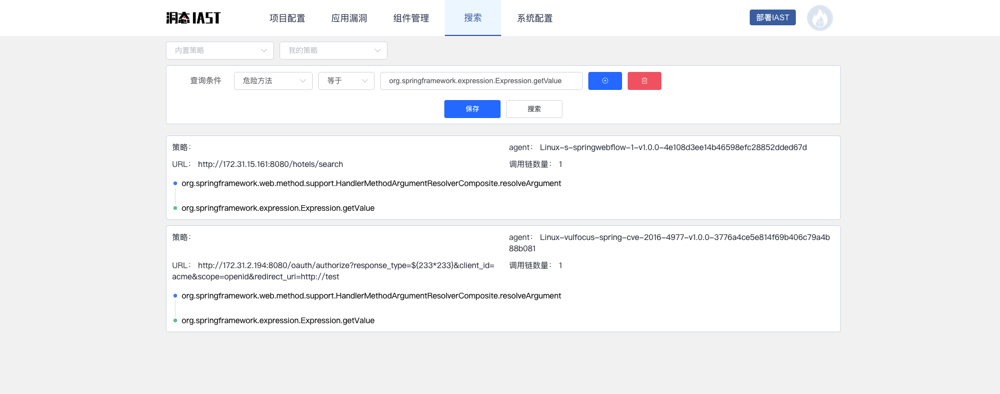
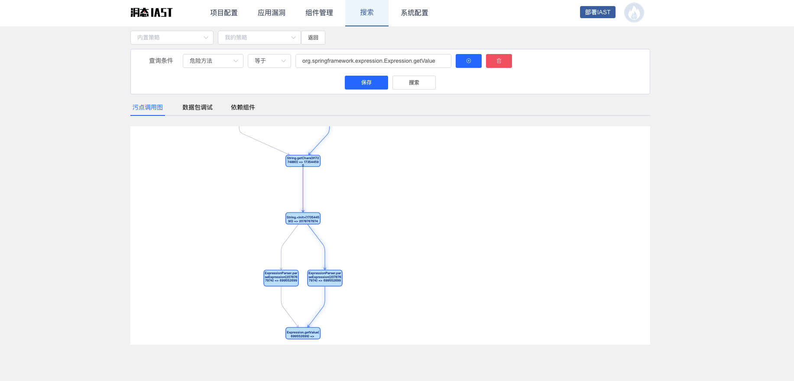

> 快速开始

灵芝IAST提供github中流行Java项目的污点链，可以直接搜索sink点进行漏洞发现，下面以**Spring Security OAuth2 远程命令执行漏洞（CVE-2016-4977）**为例，介绍如何直接使用IAST检出该漏洞。

### 代码审计挖掘0 Day的条件
- 应用环境
- 熟悉触发漏洞的方法（sink点）
- 花时间去分析污点链
- 想办法绕过框架、系统的一些限制（该步骤不一定有）

为了提升师傅们挖掘漏洞的效率，更快的挖掘漏洞，特开放如下功能：
- 搭建github star>2k的Java项目，用于师傅们测试，避免重复搭建环境；
- 自动爬取上述项目中的接口，触发流量，产生污点调用链
- 开放搜索功能，支持对上述全项目的污点调用链进行搜索，发现一条sink点，可直接搜索所有项目，查看所有命中的漏洞

现在，师傅们只需要专注于代码审计，轻松挖掘漏洞。

### 漏洞搜索
**洞态IAST**搜索功能：[http://aws.iast.huoxian.cn:8000/taint/search](http://aws.iast.huoxian.cn:8000/taint/search)

1. 指定漏洞触发的sink方法，如：`org.springframework.expression.Expression.getValue`，然后搜索，可以找到存在该sink方法的污点调用链所在的HTTP请求

2. 找到相关的HTTP请求后，根据`agent`的名称判断当前HTTP属于哪个开源项目，这里搜索的HTTP请求分别来自vulapps的`spring-webflow`靶场和vulfocus的`cve-2016-4977`靶场

3. 查看**污点调用链**的详情及**HTTP请求**的详细内容

然后根据节点的提示，找到**污点**传播的具体流程及每一个方法的上层调用，可用于快速验证和复现漏洞是否存在其他限制。

### 自建项目的漏洞检测
代码审计前，可以把**洞态IAST**的agent安装在项目中，在代码审计和不停调试的过程中，发现更多的sink点和漏洞。
