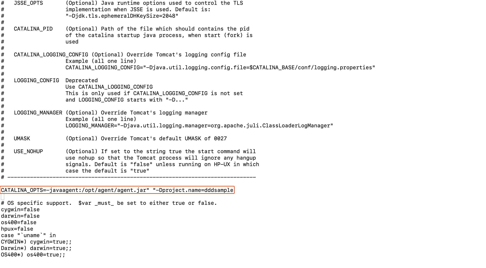

## 1.下载探针

  1. 登陆 [洞态IAST平台](https://iast.huoxian.cn/login) 在 [**部署IAST**](https://iast.huoxian.cn/deploy) 中下载洞态IAST的Agent。根据需求选择下载方式：
    
  - 点击下载 jar 包到本地

  - curl 命令下载

  2. 将 agent.jar 文件放入WEB服务器（中间件）所在机器上，保证 agent.jar 文件所在目录具有可写权限，如：`/tmp`

## 2. 安装探针

### 2.1 自动安装探针

上传 DongTai Java Agent 探针到应用服务器，查看 Web 应用的进行 Web 应用的进行 id，运行命令安装探针，如下：

  ```shell
  java -jar agent.jar -m install -p <pid>
  ```

### 2.2 手动安装探针

#### 2.2.1 SpringBoot

1. 如果使用war包的方式部署，agent的安装方式为以下具体中间件的安装方式
  
2. 如果使用`java -jar app.jar`Java 命令部署，则在启动命令中增加启动参数`-javaagent:/path/to/agent.jar`：
  
    ```shell
    java -javaagent:/path/to/agent.jar -Dproject.name=<project name> -jar app.jar
    ```

- 注意：`-Dproject.name=<project name>` 参数中的 `<project name>` 是项目名称，当项目名称与洞态IAST官网上项目管理中创建的项目名称保持一致的话，agent将自动关联至项目。

#### 2.2.2 Tomcat

1. 进入`tomcat`所在目录

2. 修改配置文件

- Linux环境下，在 `tomcat/bin` 目录下编辑 `catalina.sh` 文件，加入参数：

      ```shell
      CATALINA_OPTS=-javaagent:/path/to/server/agent.jar" "-Dproject.name=<project name>
      ```
   
   

- Windows环境下，在 `tomcat/bin` 目录下编辑 `catalina.bat` 文件，**在首行**加入参数：

    ```shell
    set CATALINA_OPTS=-javaagent:/path/to/server/agent.jar -Dproject.name=<project name>
    ```
  
- 注意：`-Dproject.name=<project name>` 为可选参数，`<project name>`与创建的项目名称保持一致，agent将自动关联至项目；如果不配置该参数，需要进入项目管理中进行手工绑定。

#### 2.2.3 JBoss/Wildfly

- JBossAS 6

    1. 进入JBoss容器的主目录，在`bin/run.sh`文件中找到`# Setup JBoss specific properties`所在行，在该行的下面插入如下行：

        ```shell
        JAVA_OPTS="$JAVA_OPTS -javaagent:/opt/jboss/iast/agent.jar -Dproject.name=<project name>"
        ```
  - 注意，`-Dproject.name=<project name>` 为可选参数，`<project name>`与创建的项目名称保持一致，agent将自动关联至项目；如果不配置该参数，需要进入项目管理中进行手工绑定。


- JBossAS 7、JBossWildfly

    1. 进入JBoss容器的主目录，根据当前服务器的启动类型：standalone、domain修改对应的配置文件

        **Standalone模式**
    
        打开`bin/standalone.sh`文件，定位`# Display our environment`所在的行，在其上方插入自定义配置，如下：

        ```shell
        JAVA_OPTS="$JAVA_OPTS -javaagent:/opt/jboss/iast/agent.jar -Dproject.name=<project name>"
        ```
    - 注意，`-Dproject.name=<project name>` 为可选参数，`<project name>`与创建的项目名称保持一致，agent将自动关联至项目；如果不配置该参数，需要进入项目管理中进行手工绑定。

#### 2.2.4 Resin

1.进入Resin的主目录，

2.打开`conf/cluster-default.xml`文件，定位到`<server-default>`所在的行，

3.在该行下面插入
```shell
<jvm-arg>-javaagent:/opt/Resin/iast/agent.jar</jvm-arg>
<jvm-arg>-Dproject.name=<project name></jvm-arg>
```
注意，`-Dproject.name=<project name>` 为可选参数，`<project name>`与创建的项目名称保持一致，agent将自动关联至项目；如果不配置该参数，需要进入项目管理中进行手工绑定。

4.重启Resin

#### 2.2.5 Jetty

1.进入jetty的主目录

2.打开`bin/jetty.sh`文件，找到`Add jetty properties to Java VM options.`所在行

3.在改行的下面插入`JAVA_OPTIONS+=( "-javaagent:/path/to/agent.jar --Dproject.name=<project name>")`

- 注意，`-Dproject.name=<project name>` 为可选参数，`<project name>`与创建的项目名称保持一致，agent将自动关联至项目；如果不配置该参数，需要进入项目管理中进行手工绑定。

4.重启jetty服务器


#### 2.2.6 WebLogic

1. 通过WebLogic的console控制台

    访问weblogic的console，例如：

    - 找到“环境”下的“服务器”，然后在服务器列表中点击需要安装agent的服务器，如：AdminServer

      

    - 进入服务器详情，点击“服务器启动”，在下方的参数一栏中填入javaagent的参数
  
      ```shell
      JAVA_OPTS="$JAVA_OPTS "-javaagent:/opt/jboss/iast/agent.jar" "-Dproject.name=<project name>
      ```
  
      注意，`-Dproject.name=<project name>` 为可选参数，`<project name>`与创建的项目名称保持一致，agent将自动关联至项目；如果不配置该参数，需要进入项目管理中进行手工绑定。

      

    - 重启服务器，使配置生效

      

2. 通过修改weblogic的config.xml文件

    找到`/u01/oracle/weblogic/user_projects/domains/base_domain/config`目录下的`config.xml`文件，定位到`<server-start>`标签下的`<arguments>`标签，在标签内添加如下配置：
`-javaagent:/path/to/agent.jar -Dproject.name=<project name>`

    注意，`-Dproject.name=<project name>` 为可选参数，`<project name>`与创建的项目名称保持一致，agent将自动关联至项目；如果不配置该参数，需要进入项目管理中进行手工绑定。


#### 2.2.7 WebSphere

1. 进入WebSphere WEB端的管理后台，在控制台左侧的导航栏里，选择`Servers -> Server Types -> WebSphere Application Server`，进入应用列表界面：

    
 
2. 选择需要安装agent的应用（以server1为例），点击进入管理页面。在新页面向下翻，找到`Server Infrastructure -> Process definition`，并点击进入：

    

3. 点击`Additional Properties -> Java Virtual Machine`进入JVM启动参数编辑界面

    

4. 找到`Generic JVM arguments`选项，开始编辑并在里面填写以下内容并保存`-javaagent:/path/to/agent.jar -Dproject.name=<project name>`

    注意，`-Dproject.name=<project name>` 为可选参数，`<project name>`与创建的项目名称保持一致，agent将自动关联至项目；如果不配置该参数，需要进入项目管理中进行手工绑定。

## 3. 重启应用服务

请重启您的应用服务器。 若尚未启动 Web 应用服务器，请启动 Web 应用服务器。然后再浏览器访问应用。稍等1-2分钟，刷新系统配置页面，点击引擎管理，查看探针是否注册成功。如果没有注册成功，按照如下步骤进行排查：

  1. 检查 agent.jar 文件
     
      运行 java -jar /path/to/agent.jar 命令，查看是否反馈 agent.jar 的使用帮助，如果没有，说明 agent.jar 文件不正确，请重新下载然后检查 agent.jar 文件，如果仍然不正确，请前往 github 给工程师提交 issue，我们会及时给您回复。

2. 检查网络情况

      在 Web 应用服务器中，检查是否可访问 http://openapi.iast.huoxian.cn:8000 服务，如果不可访问，说明网络不通，请解决网络访问的问题；如果网络不存在问题，请前往 github 给工程师提交 issue，我们会及时给您回复。
