##  IDEA Plugin — DongTai IAST 使用说明

* [配置云端自定义规则](#11111)
* [一键配置本地agent](#22222)

<h4 id="11111">一、配置云端自定义规则</h3>

#####  1、IDEA 安装 DongTai IAST {#index}

- 打开 IDEA 设置，安装 DongTai IAST
  
  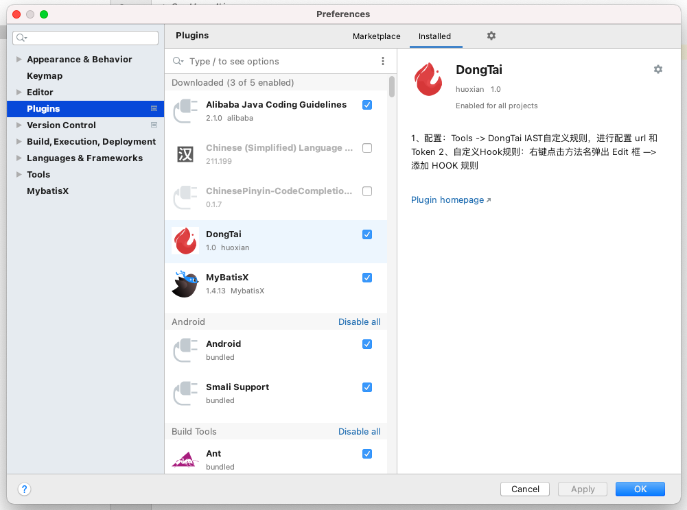

- 重启 IDEA ，检查 DongTai IAST 插件是否安装成功

  （1）检查 **“DongTai IAST”** 是否安装成功：点击 IDEA 最上方菜单栏的 **Tools** 选项，若有 **DongTai IAST** 选项栏的话则说明安装成功。
  
   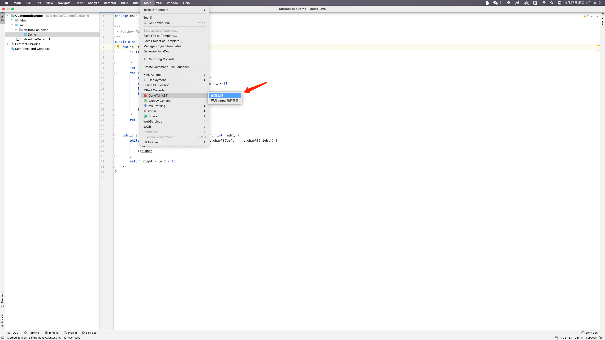
  
  （2）检查 **”添加 HOOK 规则”** 是否安装成功：在任意一个方法名上点击右键，弹出菜单栏，若有 **添加 HOOK 规则** 选项则说明安装成功。
  
  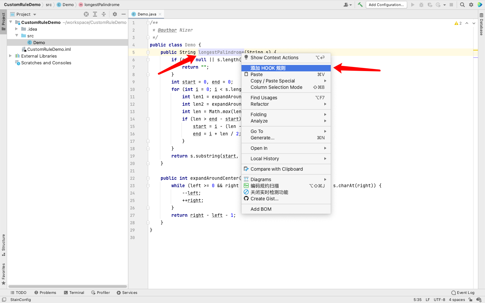

#####  2、配置"DongTai IAST 配置云端"

- 点击 IDEA 最上方菜单栏的 **Tools** 中的 **DongTai IAST 配置云端**，弹出输入框。
  
  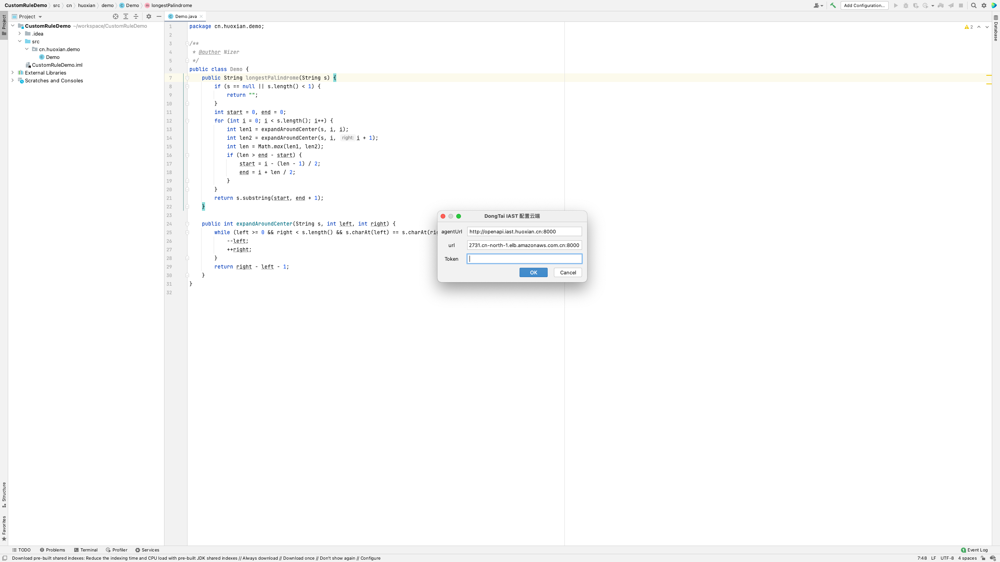

- 填写 agentUrl / url / Token
  
  agentUrl / url：自动填写洞态IAST地址，若有需求可自更改
  
  Token：登陆 [IAST平台](http://iast.huoxian.cn:8000/login) ，在 **部署IAST** 中获取 Token。
  
  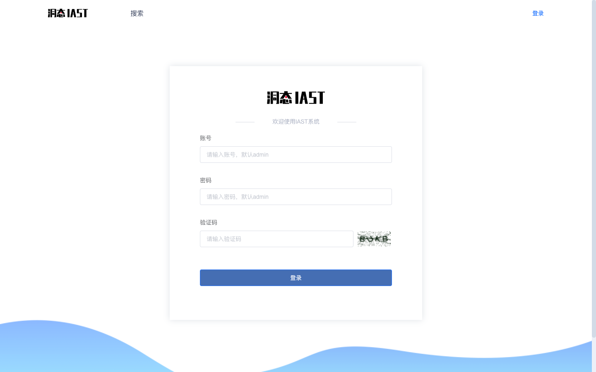
  
  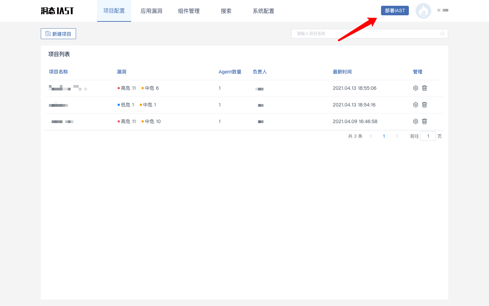
  
  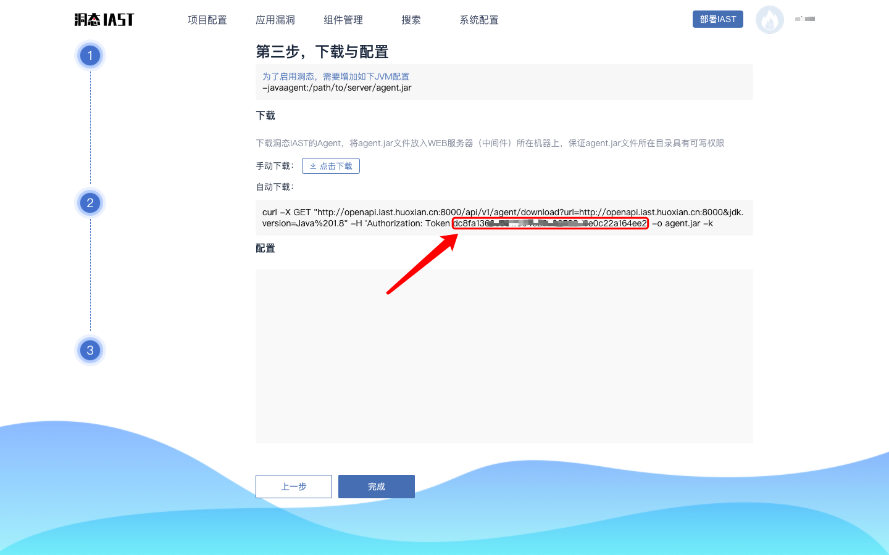

#####  3、配置"添加 HOOK 规则"

- 在要使用 HOOK 功能的方法名上点击右键，选择**添加 HOOK 规则**

- 选择规则集、规则类型、规则详情、污点来源、污点去向以及继承深度
    
    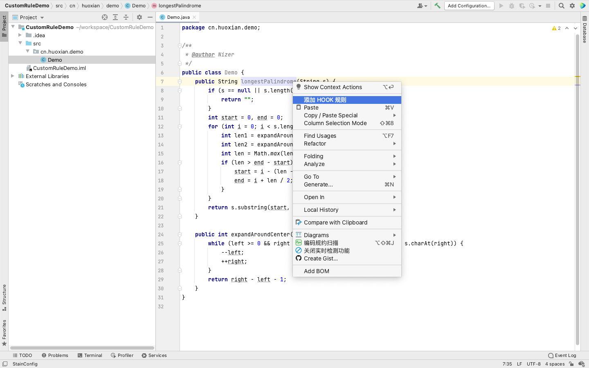
    
    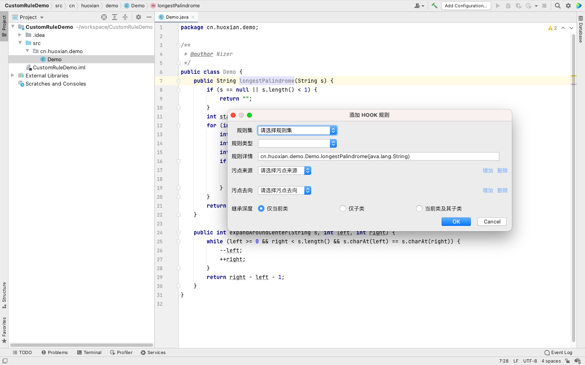
    
    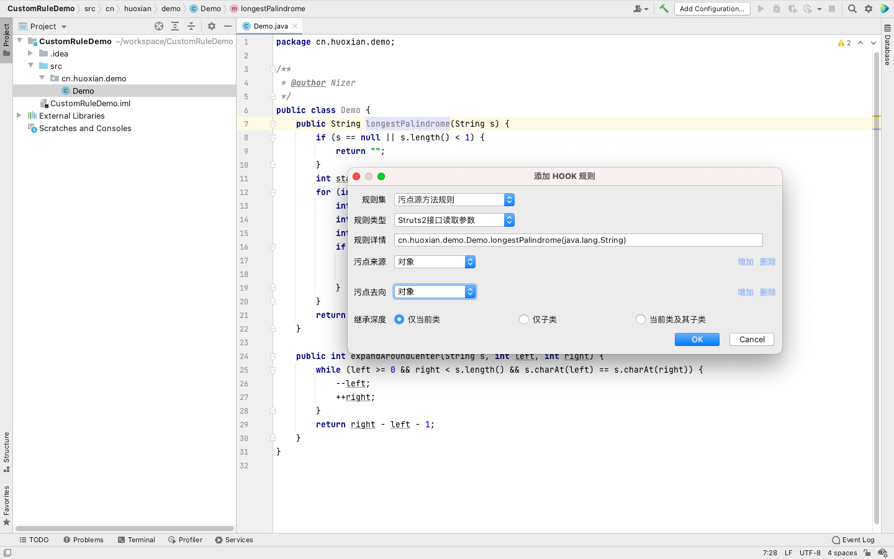

#####  4、"添加 HOOK 规则"完成后的不同结果返回

- 若完成添加，Event Log 会提示请求发送成功。
  
  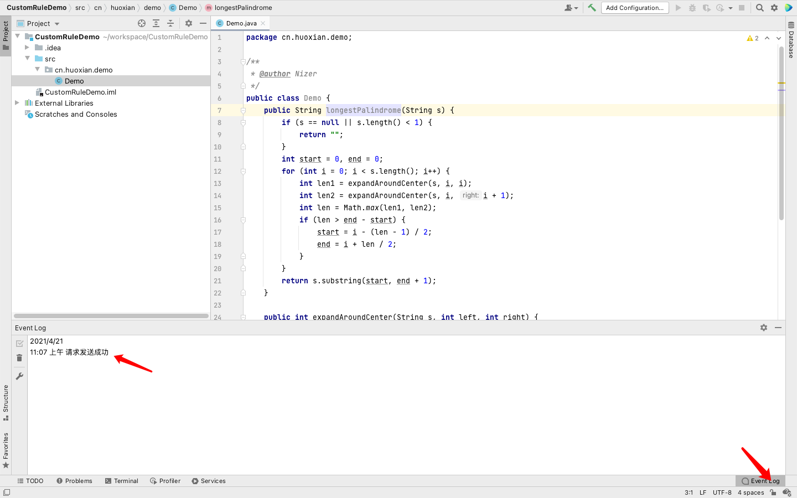
  
- 若填写 url 或者 Token 错误时，该弹框会退出并弹出提示。
  
  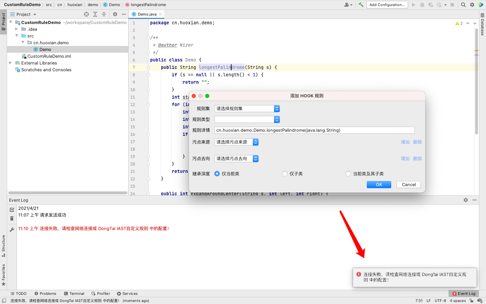

#####  5、查看已添加的 HOOK 规则
  
 - 登陆 [IAST平台](http://iast.huoxian.cn:8000/login) ，选择系统配置中的自定义规则。

  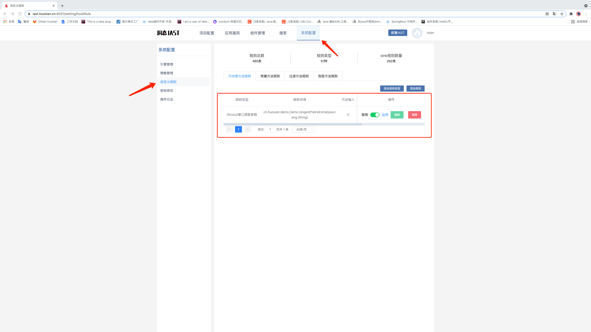

<h4 id="22222">二、一键配置本地agent</h3>

#####  1、配置"DongTai IAST 配置云端"

- 点击 IDEA 最上方菜单栏的 **Tools** 中的 **DongTai IAST 配置云端**，弹出输入框。

  

- 填写 agentUrl / url / Token

  agentUrl / url：自动填写洞态IAST地址，若有需求可自更改

  Token：登陆 [IAST平台](http://iast.huoxian.cn:8000/login) ，在 **部署IAST** 中获取 Token。

  

  

  

- 配置云端之后 agent.jar 会自动下载到本地。

#####  2、启动项目

- Run / Debug with IAST

  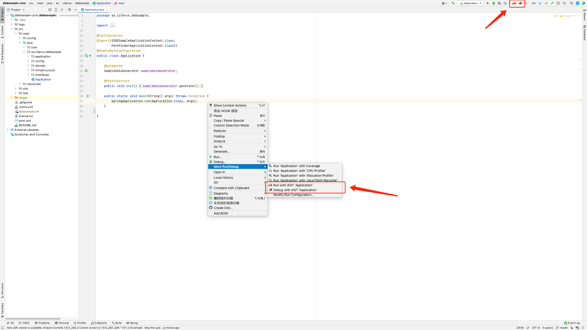
  
- agent 自动添加
  
  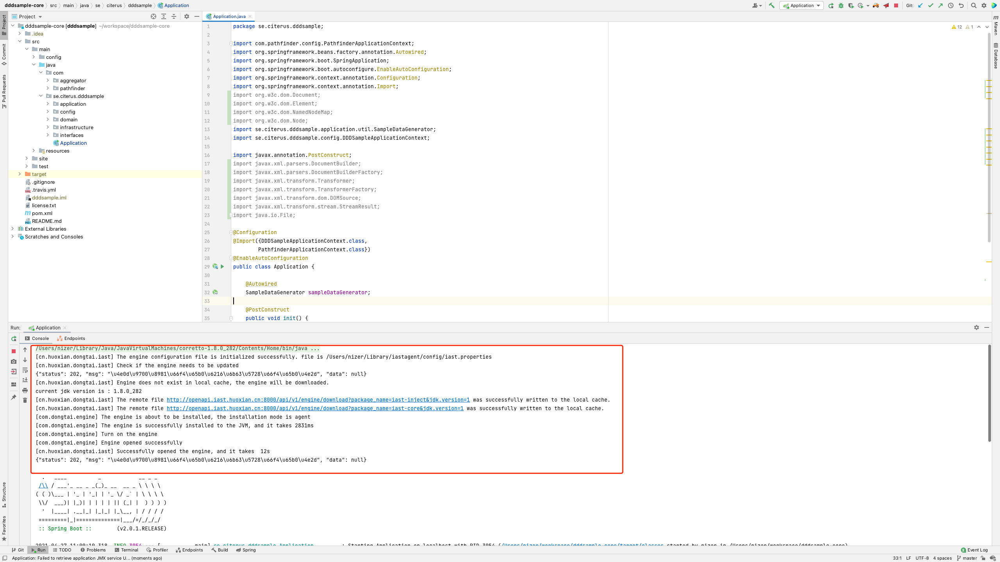
  
- 在洞态IAST中可以查看当前项目
  
  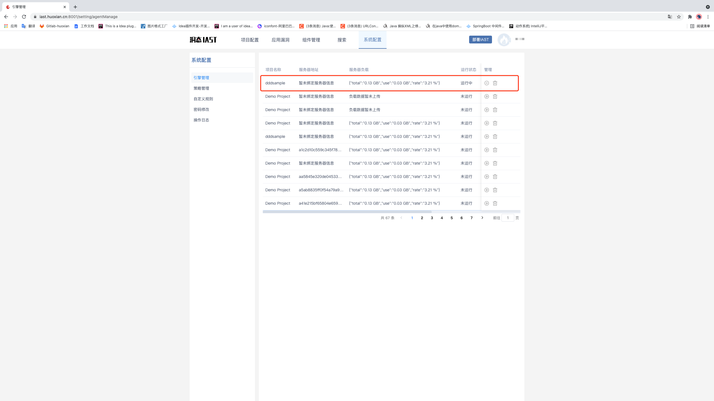

  
