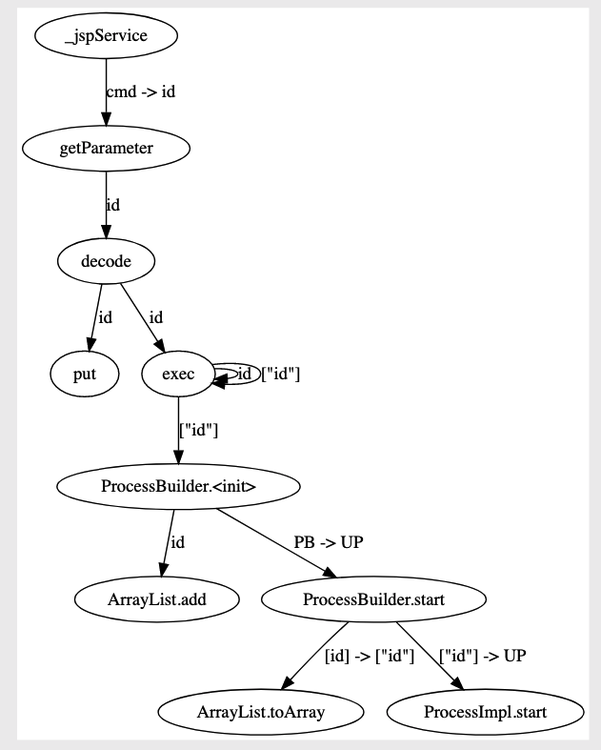

### 收集的数据类型

- agent心跳数据
- 错误日志数据
- 方法池数据
- 第三方组件数据
 
#### **agent**心跳数据

心跳数据包括网络、内存、CPU、磁盘等信息，用于判断应用的负载，自动启停。

```json
{
  "type":"0x01",
  "detail":{
    "agent":"win-hostname-ip-key",
    "language":"Java",
    "pid":"18721",
    "hostname":"hostname",
    "network":{
"name":"",
"ip":"" },
    "memory":{
      "total":"1 GB",
      "use":"0.5 GB",
      "rate":"10%"
}, "cpu":{
      "total":"0.13 GB",
      "use":"0.03 GB",
      "rate":"3.21%"
}, "disk":{
      "total":"10 GB",
      "use":"0.5GB",
      "rate":"5%"
    },
    "req_count":100,
    "server_name":"tomcat",
    "server_version":"9.x",
    "server_path":"/opt/apache-tomcat",
    "server_hostname":"ecs-beijing-001",
    "server_ip":"10.12.10.13",
    "server_port":"80"
     } 
}
```


#### 错误日志数据

记录服务器地址和日志信息，日志中关于用户的数据进行打码处理，可关闭。

```
{
  "type":"0x51",
  "detail":{
    "agent":"win-hostname-ip-key",
    "language":"Java",
    "app_name":"OWASP Benchmark",
    "server_path":"/opt/apache-tomcat",
    "log":"java.lang.Main()\njava.lang.Exec()"
	} 
}
```


#### 方法池数据

- 框架类、JDK类，原样记录，针对用户自己开发的类，进行类名隐藏
- 污点数据，统一使用污点唯一标识算法进行计算，不传输污点数据，只传输污点对应的标识
- 调用栈数据，调用栈数据依据第一条规则进行处理，但是，会保存相关调用顺序

```json
{
  "type":"0x22",
  "agent":"win-hostname-ip-key",
  "version":"1.1.3 RELEASE",
  "app_name":"OWASP Benchmark",
  "server_name":"tomcat",
  "server_path":"/opt/apache-tomcat",
  "taint_value":"20192031",
  "taint_position":"QueryString",
  "taint_param_name":"name",
  "http_url":"",
  "http_uri":"",
  "http_client_ip":"",
  "http_header":"",
  "method_pool":[
    {"invokeId":1,"class":"java.","method_name":"getParameter","taint_in":"name", "taint_out":"20192031", "stack":[]}, 
    
    {"invokeId":1,"class":"java.lang.Base64","method_name":"decode","taint_in":"20192031", "taint_out":"20192032", "stack":[]},
    
    {"invokeId":1,"class":"xxx.xxx.xxx","method_name":"getValueOfString","taint_in":"20192032", "taint_out":"20192033", "stack":[]},
    
    {"invokeId":1,"class":"xxx.xxx.xxx","method_name":"nomarlize","taint_in":"20192033", "taint_out":"20192034", "stack":[]},
    
    {"invokeId":1,"class":"java.lang.Runtime","method_name":"exec","taint_in":"20192034", "taint_out":"20192035", "stack":[]},
    
    {"invokeId":1,"class":"java.lang.Runtime","method_name":"exec","taint_in":"20192035", "taint_out":"20192036", "stack":[]}
  ] 
}
```


#### 第三方组件数据

第三方组件数据记录第三方组件的哈希值、路径和名称，用于梳理第三方组件及分析第三方组件对应的漏洞。

```json
{
  "type":"0x02",
  "detail":{
    "agent":"win-hostname-ip-key",
    "language":"Java",
    "sca_path":"/opt/apache-tomcat/bin/tomcat.jar",
    "sca_name":"struts2-core",
    "sca_signature":"83f745d2ebeaaffea24b3a4d486d1b5517e7f574",
    "algorithm":"SHA-1"
  }
}
```

### **Hook**方法的类型

- Http请求处理的入口方法
- Request对象获取外部参数的相关方法
- Response对象设置返回数据的相关方法
- 污点传播相关的方法:字符串操作(字符串拼接、字符串截取、字符串反转等)、Java集合类型的 操作、Java IO操作(文件IO/网络IO)、加解密方法(Base64加解密、AES/DES加解密、RSA加解 密等)等
- 触发漏洞相关的方法:SMTP操作方法、发送HTTP请求相关方法、XML解码相关方法、执行系统命 令的相关方法、执行LDAP查询相关的方法、执行XPATH查询相关的方法、文件操作相关的方法、 JSON反序列化相关的方法等
- 框架层XSS、SQL注入等相关的过滤方法

#### 数据处理

根据污点的唯一标识，将污点的传播过程完整的标注出来，形成污点方法池，然后将污点标识记污点方 法抽象后，发送至IAST云端，进行后续漏洞分析。

**其中**，唯一标识由数字组成，不包含任务数据，也无法利用标识逆向解析出对应的数据;方法池中的方 法会进行一定程度的抽象，保证可正常还原漏洞，同时隐藏客户相关的命名。

### **IAST**云端

云端接受Agent上报的方法池，根据方法及相关污点的唯一标识，计算出方法调用图，然后通过内置的 漏洞策略(或自定义的漏洞策略)，从方法调用图中匹配对应的漏洞链，如果存在链，则漏洞存在;如 果不存在链，则漏洞不存在；

**如图**



**策略**

指定source点和sink点的方法:getParameter() -> ProcessImpl.start()

**漏洞链**

getParameter() -> decode() -> exec() -> exec() -> ProcessBuilder.<init> -> ProcessBuilder.start -> ProcessImpl.start()

**结果**

所以，判定为存在漏洞。