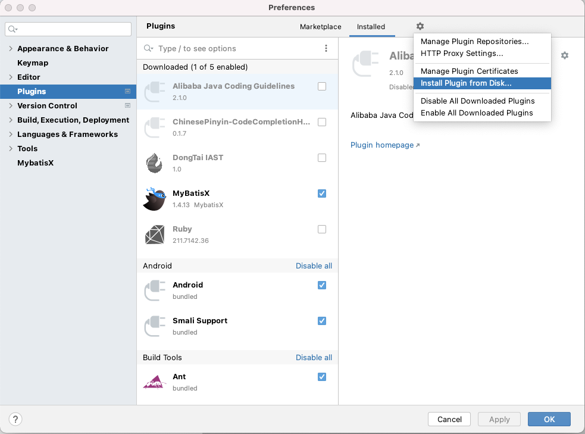
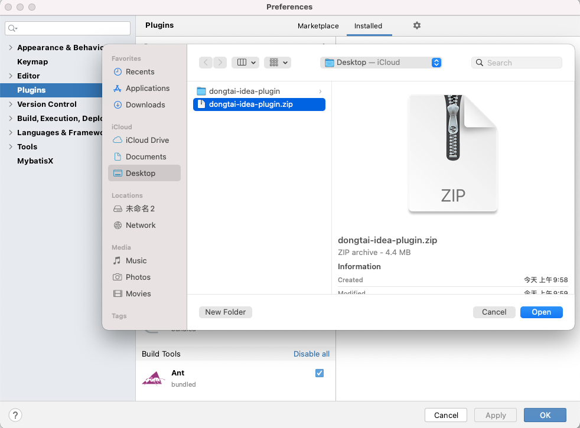
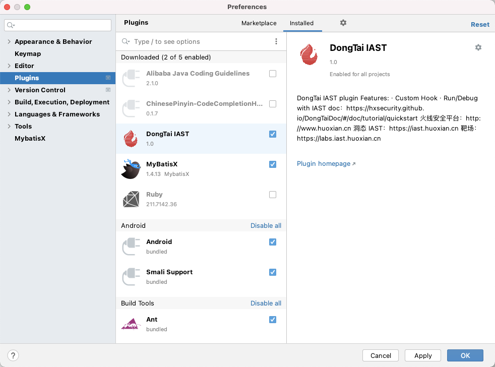
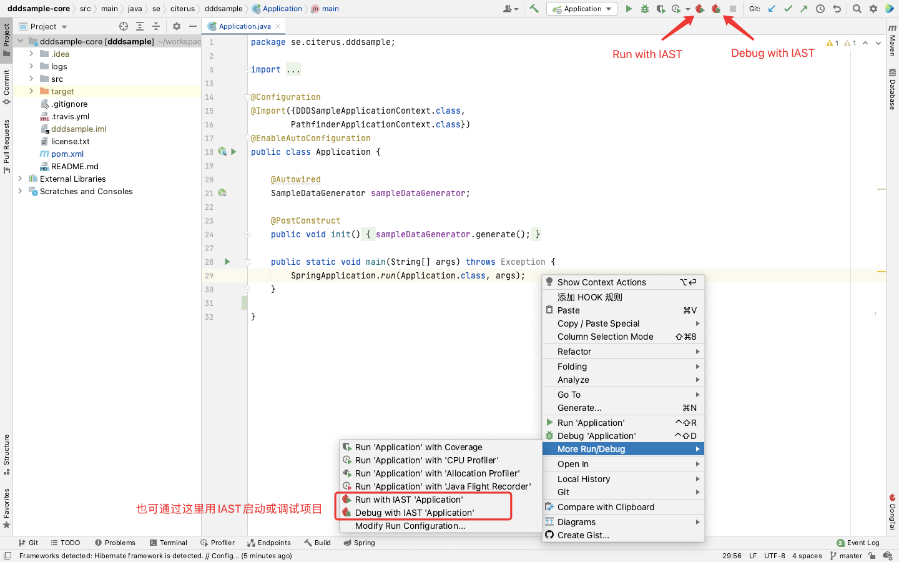
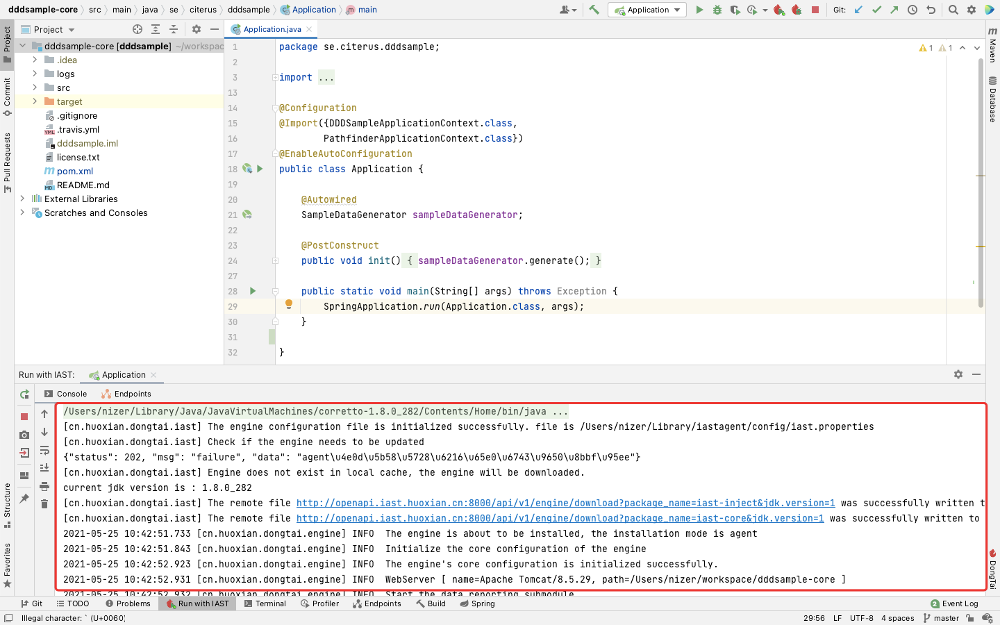
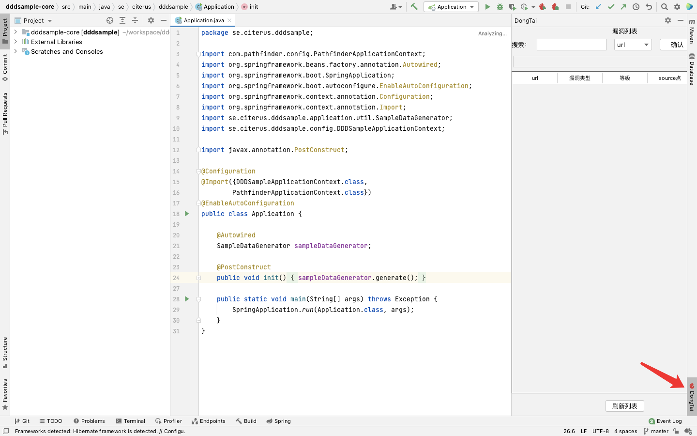

#  IDEA Plugin — DongTai IAST 使用说明

<h2 id="1">一、DongTai IAST 插件的安装与配置</h3>

###  1、IDEA 安装 DongTai IAST

- 下载 DongTai IAST 插件安装包，[下载地址](https://github.com/HXSecurity/DongTai-Plugin-IDEA/releases/download/v1.0/DongTai-Plugin-IDEA.zip)

- 打开 IDEA 设置，选择从本地安装 IDEA 插件，安装DongTai IAST插件安装包**dongtai-idea-plugin.zip**
  
  

  
  
  

- 重启 IDEA ，查看已安装的插件，检查 DongTai IAST 插件是否安装并启用成功

###  2、配置"DongTai IAST 配置云端"

- 点击 IDEA 最上方菜单栏的 **Tools** 中的 **DongTai IAST 配置云端**，弹出输入框。
  
  

- 填写 agentUrl / url / Token
  
  agentUrl / url：自动填写洞态IAST地址，若有需求可自更改
  
  Token：登陆 [IAST平台](https://iast.huoxian.cn/login) ，在 **部署IAST** 中获取 Token。
  
  
  
  
  
  

<h2 id="2">二、DongTai IAST 插件功能</h3>

### 1、快速添加 HOOK 规则

####  (1) 配置"添加 HOOK 规则"

- 在要使用 HOOK 功能的方法名上点击右键，选择**添加 HOOK 规则**

- 选择规则集、规则类型、规则详情、污点来源、污点去向以及继承深度
    
    
    
    
    
    

####  (2) "添加 HOOK 规则"完成后的不同结果返回

- 若完成添加，Event Log 会提示请求发送成功。
  
  
  
- 若填写 Token 错误时，该弹框会退出并弹出提示。
  
  

####  (3) 查看已添加的 HOOK 规则
  
 - 登陆 [IAST平台](https://iast.huoxian.cn/login) ，选择系统配置中的自定义规则。 

  

[comment]: <> (<h4 id="2">二、一键配置本地agent</h3>)
### 2、Run / Debug With IAST

####  (1) 功能简介

- 使用 Run/Debug With IAST 功能可实现启动您的应用可实现一键添加 IAST，边调试边出洞

##### (2) 启动项目

- 以某开源项目为例，使用Run / Debug with IAST启动项目

  
  
- 通过控制台打印的日志可知 agent 已添加
  
  

### 3、实时查看应用漏洞

- 在插件中实时查看漏洞信息

  
