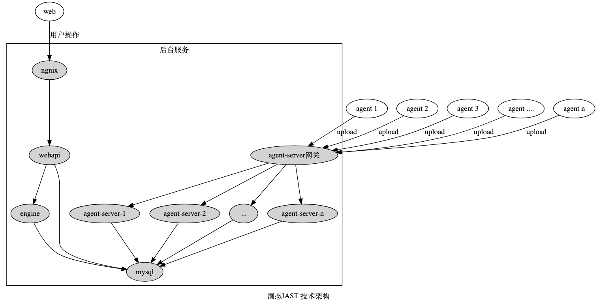

> 洞态IAST的版本、功能、架构和部署方案

## 简介
洞态IAST包含前端项目和后端API，前端项目基于`Vue`、`TypeScript`开发，后端项目基于`Django`、`Django Rest Framework`开发。包括：策略搜索、项目列表、项目详情、新建项目、导出项目漏洞、应用漏洞管理、第三方组件管理、Agent管理、Hook规则管理、用户管理等功能。

#### 架构图

## 版本
洞态IAST有两个版本：
- SaaS版本
- 本地化部署版本 

### SaaS版本
SaaS版本地址：[https://iast.huoxian.cn](https://iast.huoxian.cn)

### 本地化部署版本 【针对联合共建的企业进行开源】
开源版本需要自行申请，申请方式见[下文](doc/tutorial/versions?id=申请方式)

#### 单机版部署

- [x] [docker-compose一键部署](https://github.com/HXSecurity/DongTai/tree/main/deploy/docker-compose)
- [x] [源码一键部署](https://github.com/HXSecurity/DongTai#%E4%B8%80%E9%94%AE%E6%BA%90%E7%A0%81%E9%83%A8%E7%BD%B2docker%E7%8E%AF%E5%A2%83)
- [ ] docker一键部署方案待更新

#### 集群版部署

- [x] [Kubernetes版本一键部署](https://github.com/HXSecurity/DongTai/blob/main/deploy/kubernetes)

#### 申请方式
洞态IAST合作伙伴计划—整体开源联合开发，[报名地址](https://jinshuju.net/f/PKPl99)
